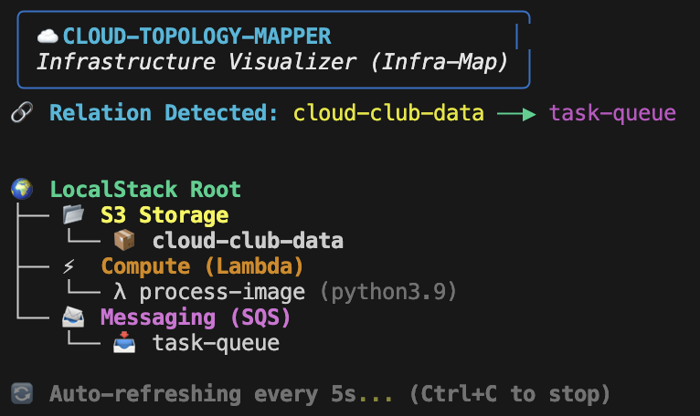

# ☁️ Cloud-Topology-Mapper (Infra-Map)
Cloud-Topology-Mapper is a terminal-based infrastructure visualizer that automatically discovers and maps AWS resources running on LocalStack. It goes beyond a simple inventory list by analyzing resource metadata to visualize event-driven relationships and logic flows in real-time.

## 🌟 Key Features
* **Live Infrastructure Discovery:** Periodically scans the LocalStack environment to identify S3 Buckets, Lambda Functions, and SQS Queues.
* **Relationship Mapping:** Automatically detects and visualizes trigger-based connections (e.g., S3 → SQS) by parsing ```Notification Configurations```
* **Real-Time Dashboard:** Features a 5-second auto-refresh cycle powered by the Rich library for a dynamic DevOps experience.
* **M-Series Compatibility:** Specifically engineered to handle network layer constraints and protocol mismatches on macOS (Apple Silicon).

## 🛠️ Tech Stack
* **Language:** Python 3.13
* **AWS Interaction:** Boto3 & AWS CLI v2
* **Local Simulation:** LocalStack 3.0.2 (Community Edition)
* **UI/Terminal:** Rich (Console & Tree components)

## 🚀 Quick Start
### 1. Prerequisites
  Ensure you have Docker and Python installed on your system.

### 2. Launch Infrastructure

Update your ```docker-compose.yml``` to use LocalStack 3.0.2 for optimal protocol compatibility.

```
docker-compose up -d
```


### 3. Provision Resources

Use the included automated script to set up your S3, SQS, and Lambda resources:

```
python3 create_infra.py
```


### 4. Run the Visualizer

Start the live mapping dashboard:

```
python3 main.py
```


## 🔍 Discovery Logic & Topology
The tool doesn't just list what exists; it understands how they interact. When an S3 bucket is configured to send notifications to an SQS queue, the engine detects this link via the ```get_bucket_notification_configuration``` API and draws a relational arrow in the dashboard.


## 📊 Visualization in Action

Below is a snapshot of the **Infra-Map** dashboard discovering the relationship between an S3 bucket and an SQS queue in real-time:


